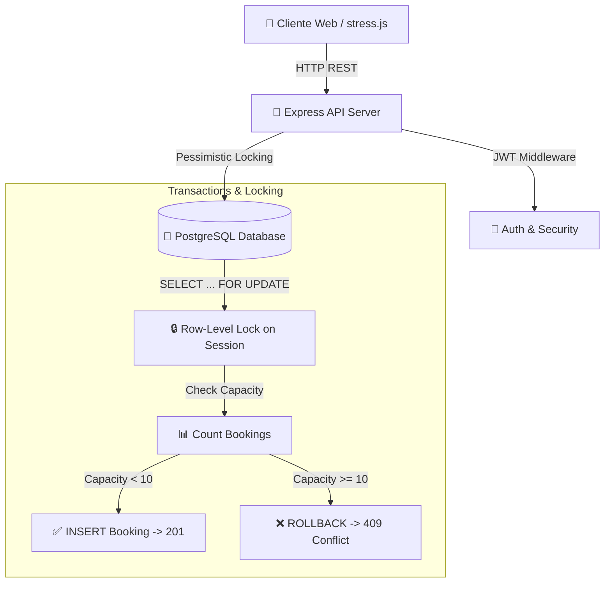

# 🗺️ Índice & Arquitectura General del Sistema

Bienvenido a la documentación interactiva en formato **Obsidian / Graphify**. Cada nodo está interconectado mediante enlaces wiki `[[...]]` para facilitar la navegación visual en el grafo de conocimiento.

---

## 📌 Grafo de Conocimiento del Proyecto

- [[01 - Overbooking & Concurrency Control]] — Estrategia de bloqueo pesimista `SELECT ... FOR UPDATE` y prueba de fuego con `stress.js`.
- [[02 - Cursor Pagination & EXPLAIN ANALYZE]] — Paginación por cursor `(starts_at, id)` e informe de rendimiento SQL (< 1 ms).
- [[03 - Idempotency Key Pattern]] — Manejo de retries con header `Idempotency-Key` y persistencia de respuestas.
- [[04 - Schedule Overlap & Edge Cases]] — Validación de intervalos temporales y casos borde (sesión envolvente).

---

## 🏗️ Resumen de la Arquitectura

---

## ⚙️ Tecnologías & Comandos Clave (pnpm)

- **Paquetes**: `pnpm install`
- **Servidor Dev**: `pnpm dev`
- **Sembrado BD**: `pnpm seed`
- **Prueba de Carga**: `pnpm stress` (O `node stress.js --session=42 --concurrency=200`)
- **Tests Automatizados**: `pnpm test`
