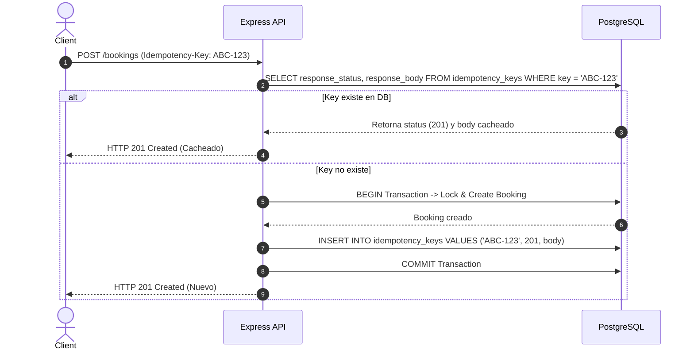

# 🔑 Patrón de Idempotencia (`Idempotency-Key`)

[[00 - Index & Architecture Overview]] | [[01 - Overbooking & Concurrency Control]]

---

## 🎯 Requisito de Negocio
Si el cliente envía dos veces una petición `POST /bookings` con el mismo header `Idempotency-Key: <key>` (debido a un timeout de red o reintento de cliente):
- Debe crearse **una sola reserva**.
- Ambas peticiones deben retornar la **misma respuesta** (status HTTP + body).

---

## 🗄️ Tabla de Idempotencia (`idempotency_keys`)

```sql
CREATE TABLE idempotency_keys (
    key VARCHAR(255) PRIMARY KEY,
    user_id INTEGER NOT NULL REFERENCES users(id) ON DELETE CASCADE,
    response_status INTEGER NOT NULL,
    response_body JSONB NOT NULL,
    created_at TIMESTAMPTZ NOT NULL DEFAULT CURRENT_TIMESTAMP
);
```

---

## 🔁 Flujo de Ejecución


